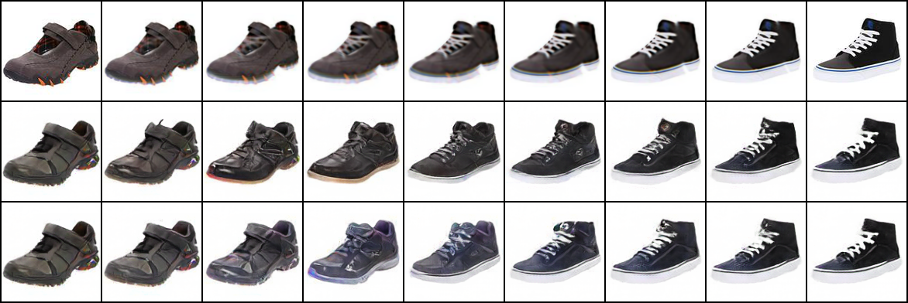
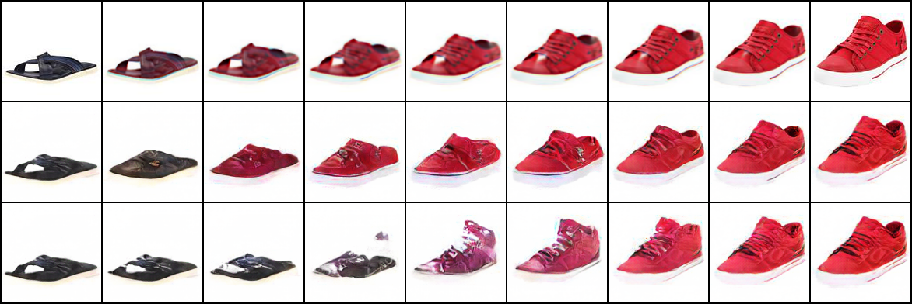
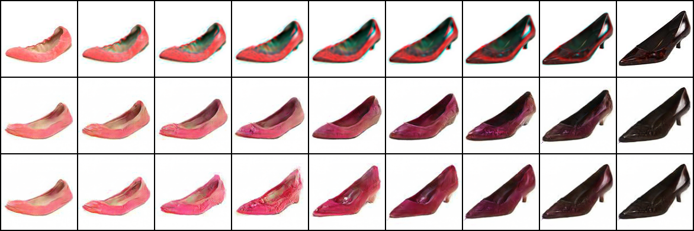

# image_barycenters
This repository can be used to reproduced the results reported in our [paper](https://arxiv.org/abs/1912.11545), accepted to CVPR 2020.

If you use our work, please cite it:
```
@article{simon2019barycenters,
  title={Barycenters of Natural Images - Constrained Wasserstein Barycenters for Image Morphing},
  author={Simon, Dror and Aberdam, Aviad},
  journal={Proceedings of the IEEE Conference on Computer Vision and Pattern Recognition},
  year={2020}
}
```

# Training the model
1. Download your data to the dataset folder. You can use the provided download script to start off with the Zappos50K dataset.
2. Run train.py

# Creating image transformations
Run generate_morph.py. If you do not mention specific images, random samples will be chosen from the provided dataset.

By default, the results will be saved to the "results" folder. Each output contains 3 rows in the following order:
1. Optimal transport
2. Our method
3. GAN linear interpolation

# Some samples:



